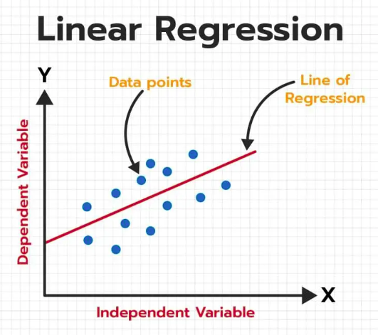
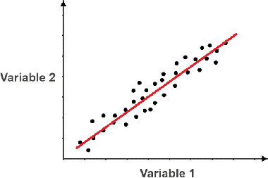
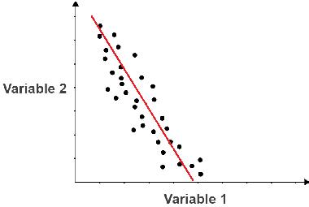
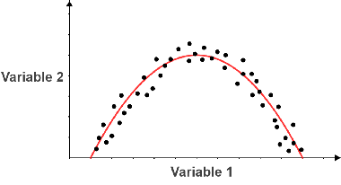
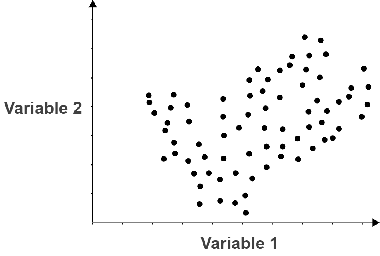
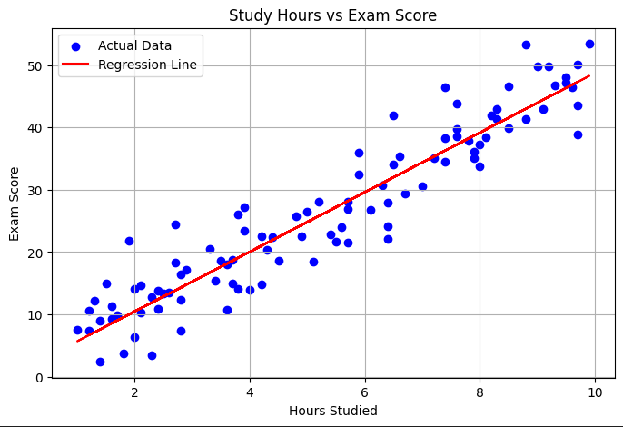
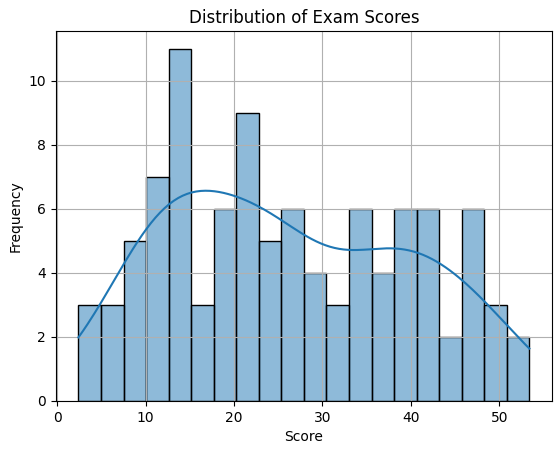

# Predict Exam Score from Study Hours

## Objective
This project aims to predict exam scores based on the number of hours spent studying using a simple machine learning model.

## Dataset
You can use your own dataset in .csv format with Hours and Score columns.

## Choose a Model
Select `Linear Regression` as the prediction model because:
- The relationship between study hours and exam scores is approximately linear.

## What is Linear Regression ?



Here Y is called a dependent or target variable and X is called an independent variable also known as the predictor of Y. There are many types of functions or modules that can be used for regression. A linear function is the simplest type of function. Here, X may be a single feature or multiple features representing the problem.

### Equation

The equation of Linear Regression is `y = mx + b` when
- `y` is the predicted value (dependent variable)
- `x` is the input (independent variable)
- `m` is the slope of the line (how much y changes when x changes)
- `b` is the intercept (the value of y when x = 0)

The best-fit line will be the one that optimizes the values of m (slope) and b (intercept) so that the predicted y values are as close as possible to the actual data points.

### Example

```bash
Score=5×Hours Studied+20
```

- If you study for 4 hours → Score = 5×4 + 20 = 40
- If you study for 8 hours → Score = 5×8 + 20 = 60

## Correlation

### Positive Linear Relationship



- When X increases → Y also increases.
- Points trend upward from the lower-left to the upper-right.
- Example: More study hours → Higher exam scores.
- Correlation coefficient (r) > 0.

### Negative Linear Relationship



- When X increases → Y decreases.
- Points trend downward from the upper-left to the lower-right.
- Example: More days absent → Lower exam scores.
- Correlation coefficient (r) < 0.

### No Apparent Linear Relationship



- No clear pattern showing that Y consistently increases or decreases with X.
- Points are scattered randomly without a noticeable slope.
- Example: Shirt color → Exam score (no logical connection).
- Correlation coefficient (r) ≈ 0.

### No correlation



The two variables below do not exhibit a discernible pattern, so they have no correlation.

## Example Predict

### Import 

```python
import pandas as pd
import matplotlib.pyplot as plt
import seaborn as sns
from sklearn.linear_model import LinearRegression
from sklearn.model_selection import train_test_split
from sklearn.metrics import mean_absolute_error, mean_squared_error, r2_score
import numpy as np
```

- Imports pandas as pd to handle table-like data using DataFrames.
- Imports matplotlib.pyplot as plt for plotting graphs.
- Imports seaborn for statistical data visualization (e.g., histograms with KDE curves).
- Imports the Linear Regression model from scikit-learn.
- Imports train_test_split to split the dataset into training and testing sets.
- Imports evaluation metrics: MAE, MSE, and R².
- Imports NumPy for numerical calculations (e.g., square roots).

### Load Data

```python
df = pd.read_csv("/HoursAndScores_100.csv")
df = df.loc[:, ['Hours', 'Scores']]
```

- Reads a CSV file named HoursAndScores_100.csv from the root directory /.
- Returns it as a DataFrame and assigns it to the variable df.
- The CSV should have at least the columns Hours and Scores.

### Define Features / Target and Split Data

```python
X = df[['Hours']]
y = df['Scores']
X_train, X_test, y_train, y_test = train_test_split(X, y, test_size=0.2, random_state=42)
```

- Sets X as the feature matrix containing the Hours column (kept as a DataFrame, not Series).
- Sets y as the target vector using the column Scores.
- Important: In the created data, the column is Score (no s). Using Scores will cause an error unless you rename the column or change this line.
- X_train
    - The features (input data, e.g., Hours studied) used to train the model.
    - This is the 80% (because test_size=0.2) portion of X selected for training.
- X_test
    - The features used to test the model after training.
    - This is the 20% portion of X reserved for evaluation.
- y_train
    - The target values (output data, e.g., Scores) corresponding to X_train.
    - Used by the model to learn the mapping from X_train → y_train.
- y_test
    - The target values corresponding to X_test.
    - Used to check how well the trained model performs on unseen data.
- Splits the data into 80% training and 20% testing.
- random_state=42 ensures the split is reproducible.

### Train the Model

```python
model = LinearRegression()
model.fit(X_train, y_train)
```

- Creates a LinearRegression model object.
- Fits the model to the training data (learns slope and intercept).

### Predictions

```python
predections = model.predict(X_test)
```

- Predicts exam scores for the testing set.
- Variable name is misspelled — should be predictions, but kept as in the original file.

### Visualize — Scatter Plot + Regression Line

```python
plt.figure(figsize=(8,5))
plt.scatter(X, y, color='blue', label='Actual Data')
plt.plot(X, model.predict(X), color='red', label='Regression Line')
plt.xlabel('Hours Studied')
plt.ylabel('Exam Score')
plt.title('Study Hours vs Exam Score')
plt.grid(True)
plt.legend()
plt.show()
```

- Creates a new plot with a specific size.
- Plots actual data points in blue.
- Plots the regression line in red, using predictions from the model for all X.
- Labels the axes, sets a title, enables gridlines, shows legend, and displays the plot.



- Blue Dots (Actual Data)
    Each dot represents a real student’s data.
    - X-axis = Number of hours studied
    - Y-axis = Exam score
    Example: A point at (6, 35) means the student studied for 6 hours and scored 35.
- Red Line (Regression Line)
    This is the straight line created by the Linear Regression model to show the trend.
    - Upward slope → Positive relationship between hours studied and exam score.
    - Points close to the line mean the prediction is very close to the actual data.
    - Points far from the line show larger prediction errors (residuals).
- Trend
    Most points follow the red line’s direction, meaning more study hours tend to result in higher scores.
- Conclusion:
    - There is a positive correlation between study hours and exam scores.
    - The more hours students study, the higher their scores tend to be.
    - The regression line fits the data well — most points are close to the line, meaning the Linear Regression model explains the relationship fairly well.
    - A few outliers exist (students whose scores are unexpectedly high or low compared to the trend).

**Generally, more study hours mean higher exam scores.**

### Histogram of Scores

```python
sns.histplot(data=df, x='Scores', bins=20, kde=True)
plt.title('Distribution of Exam Scores')
plt.xlabel('Score')
plt.grid(True)
plt.show()
```

- Plots a histogram of the Scores column with 20 bins and a KDE curve.
- Again, must ensure Scores exists in df.
- Titles the plot, labels the x-axis, enables gridlines, and shows the plot.



This plot is a histogram with a KDE (Kernel Density Estimate) curve.

- X-axis (Score) → The range of exam scores.
- Y-axis (Frequency) → How many students fall into each score range.
- Blue bars:
    - Each bar represents a score interval (bin).
    - The height of the bar shows the number of students whose scores fall in that range.
    - For example, a tall bar around 10–15 means many students scored between 10 and 15.
- Blue curve (KDE):
    - A smoothed version of the distribution to show the general shape of score distribution.
    - Peaks in the curve mean more students scored in that range.
    - Valleys mean fewer students scored there.
- Trend in this chart:
    - Scores are spread across the range from about 0 to 50.
    - There are a few peaks, meaning there are multiple common score ranges, not just one.
- Conclusion:
    - Scores are widely spread, from very low to around 50.
    - The distribution is not perfectly normal — it has multiple peaks, suggesting several groups of students with different score ranges.
    - High concentrations of students appear in certain ranges, e.g., low scores (~10–15), mid-range (~20–25), and higher scores (~40–45).
    - This indicates varying performance levels among students rather than everyone performing at a similar level.

**Students’ scores are spread across different groups — some low, some mid, and some high.**

## Evaluate the Model
Check how accurate the model is using metrics like:
```python
| Metric                             | Description                                                        |
| ---------------------------------- | ------------------------------------------------------------------ |
| **MAE** (Mean Absolute Error)      | Average of absolute differences (no squaring)                      |
| **MSE** (Mean Squared Error)       | Average of squared differences                                     |
| **RMSE** (Root Mean Squared Error) | Square root of MSE (same units as the original target)             |
| **R²** (R-squared)                 | Proportion of variance explained by the model (ranges from 0 to 1) |
```

### MSE (Mean Squared Error)
- **What it is**: The average of the squared differences between actual and predicted values.
- **Pros**: Penalizes large errors more heavily.
- **Cons**: The result is in squared units, which can be harder to interpret.
- **Code**: mean_squared_error(y_test, predections)

### MAE (Mean Absolute Error)
- **What it is**: The average of the absolute differences between actual and predicted values.
- **Pros**: Not as sensitive to outliers as MSE/RMSE.
- **Cons**: Doesn’t penalize large errors as heavily.
- **Code**: mean_absolute_error(y_test , predections)

### RMSE (Root Mean Squared Error)
- **What it is**: The square root of the MSE, bringing the error back to the same unit as the target variable.
- **Pros**: Easier to interpret than MSE because it’s in the original scale.
- **Cons**: Still sensitive to outliers, like MSE.
- **Code**: rmse = np.sqrt(mean_squared_error(y_test, predections))

### R² Score (Coefficient of Determination)
- **What it is**: Indicates the proportion of variance in the dependent variable that is explained by the model.
- **Range**:
    1.0 → Perfect prediction
    0 → No better than predicting the mean
    Negative → Worse than predicting the mean
- **Pros**: Easy to understand as a percentage of explained variance.
- **Cons**: Doesn’t directly measure the size of the prediction errors.
- **Code**: r2_score(y_test, predections)

### Residuals

```python
Residuals = y_test - predections
Residuals
```

- Calculates residuals = actual values − predicted values.
- Displays the residuals.

### Final Fit on All Data & Add Columns

```python
final_model = LinearRegression()
final_model.fit(X,y)
y_hat = final_model.predict(X)
df['predection'] = y_hat
df['residual'] = df['Scores'] - df['predection']
df
```

- Creates a new LinearRegression model.
- Fits this model to the entire dataset.
- Predicts exam scores for all data points.
- Adds a new column predection to df containing the predicted scores (spelling kept from original).
- Adds a residual column = actual score − predicted score.
- Again, Scores must exist in df.
- Displays the full DataFrame with original data, predictions, and residuals.