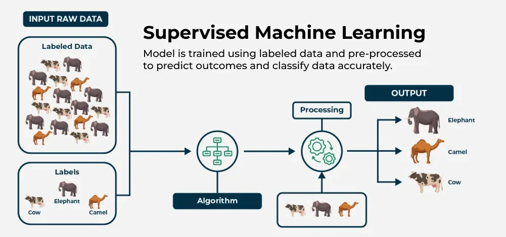
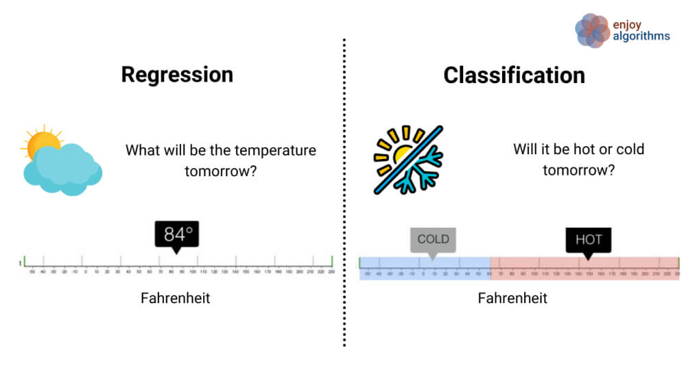

# Difference Between Classification and Regression

## What is Supervised Learning?



```python
x (input) -> y (output label)
learn from being given  right answer
```
## Definition

Supervised learning is a type of machine learning where algorithms learn input-to-output (x → y) mappings from labeled examples. The algorithm is trained on data that includes both the input (x) and the correct output (y), enabling it to predict outputs for new, unseen inputs.

- Definition: supervised learning algorithms learn to predict input, output or X to Y mapping.

## Overview

In **machine learning**, both **classification** and **regression** are types of **supervised learning**.  
The main difference lies in the type of output variable:

- **Classification** → Predicts **categories or classes** (discrete values)
- **Regression** → Predicts **continuous numerical values**

---

## Types of Supervised Learning



ref : https://www.superannotate.com/blog/supervised-learning-and-other-machine-learning-tasks

### Classification

**Definition:**  
A model that predicts which category a given input belongs to.

**Example use cases:**
- Email spam detection (Spam / Not Spam)
- Disease diagnosis (Positive / Negative)
- Image recognition (Cat / Dog / Other)

**Model types for classification:**
- Logistic Regression
- Decision Tree Classifier
- Random Forest Classifier
- Support Vector Machine (SVM)
- Neural Network (for classification tasks)

### Classification Example

We will use the famous Iris dataset to classify flowers.

```python
import pandas as pd
from sklearn.model_selection import train_test_split
from sklearn.linear_model import LogisticRegression
from sklearn.metrics import accuracy_score, classification_report

# Load dataset from CSV
df = pd.read_csv("iris.csv")

# Separate features and labels
X = df.drop(columns=['label'])
y = df['label']

# Split dataset (80% training, 20% testing)
X_train, X_test, y_train, y_test = train_test_split(
    X, y, test_size=0.2, random_state=42
)

# Create and train the model
clf = LogisticRegression(max_iter=200)
clf.fit(X_train, y_train)

# Predict on the test set
y_pred = clf.predict(X_test)

# Show results
print("Classification Accuracy:", accuracy_score(y_test, y_pred))
print("\nClassification Report:\n", classification_report(y_test, y_pred))

```

### Example Out

```python
Classification Accuracy: 1.0

Classification Report:
              precision    recall  f1-score   support

           0       1.00      1.00      1.00        10
           1       1.00      1.00      1.00         9
           2       1.00      1.00      1.00        11

    accuracy                           1.00        30
   macro avg       1.00      1.00      1.00        30
weighted avg       1.00      1.00      1.00        30
```

---

### Regression

**Definition:**  
A model that predicts a continuous numerical value based on input features.

**Example use cases:**
- Predicting house prices
- Forecasting temperature
- Estimating sales revenue

**Model types for regression:**
- Linear Regression
- Decision Tree Regressor
- Random Forest Regressor
- Support Vector Regression (SVR)
- Neural Network (for regression tasks)

### Regression Example

```python
import pandas as pd
from sklearn.model_selection import train_test_split
from sklearn.linear_model import LinearRegression
from sklearn.metrics import mean_squared_error

# Load dataset from CSV
df = pd.read_csv("california_housing.csv")

# Separate features and target
X = df.drop(columns=['MedHouseVal'])
y = df['MedHouseVal']

# Split dataset
X_train, X_test, y_train, y_test = train_test_split(
    X, y, test_size=0.2, random_state=42
)

# Create and train model
reg = LinearRegression()
reg.fit(X_train, y_train)

# Predict
y_pred = reg.predict(X_test)

# Evaluate
print("Regression MSE:", mean_squared_error(y_test, y_pred))
```

### Example Output

```python
Regression MSE: 0.555891598695806
```

---

## 5. Summary Table

| Feature              | Classification                  | Regression                 |
|----------------------|---------------------------------|----------------------------|
| Output type          | Category / label (discrete)     | Continuous numeric value   |
| Examples             | Spam detection, image labeling  | House price, temperature   |
| Common algorithms    | Logistic Regression, SVM, RF    | Linear Regression, SVR, RF |
| Evaluation	       | Mean squared error	             | Accuracy/Precision         |
| Model Goal	       | Fit optimal line/curve	         | Find decision boundary     |